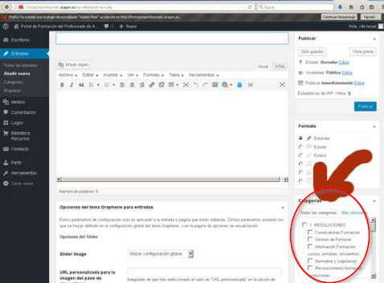
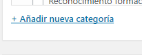
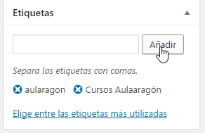
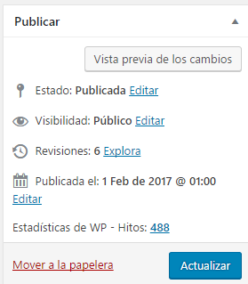

# Categorías, etiquetas y publicar

## Categorías

Seleccionar entre las categorías que están disponibles. Se pueden seleccionar varias a la vez, o añadir categorías

En el caso de las actividades, puede ser las fechas de las sesiones o las diferentes temáticas o items que trabajan y quieren colgar los contenidos.

## Etiquetas

Son la palabras clave que facilitan encontrar la entrada, recomendamos usar siempre las mismas, por ejemplo para un artículo de Aularagon no es adecuado en un artículo utilizar la etiqueta **aularagon **y en otro artículo parecido o en el mismo **cursos Aulaaragón **como en la figura, clasificaría las entradas en etiquetas distintas

Podemos poner más de una

## Publicar

