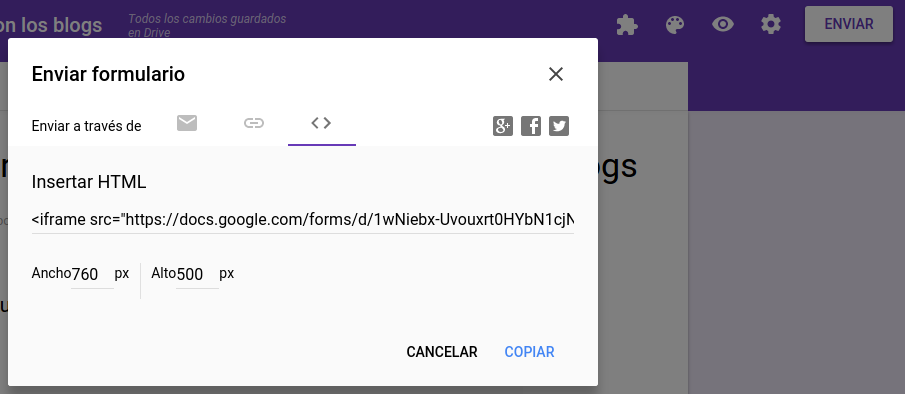

# Cómo se envía

Tenemos varios métodos en Enviar :

<ul>
- Lo podemos poner en la página web y que lo hagan tranquilamente en casa
- Si es en directo podemos ponerlo en el Twitter o generar el código QR (ya lo vimos en el tema 1) y proyectarlo y que la gente lo haga con el móvil 

No hace falta que el usuario esté registrado en Google para hacer el cuestionario **al menos que marquemos en el cuestionario que los usuarios no pueden repetirlo, luego sí que tienen que estar registrados en Google para que Google controle que no se pueda repetir ¡¡es lógico !!**

