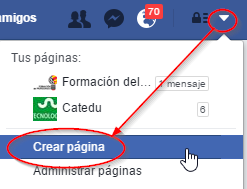
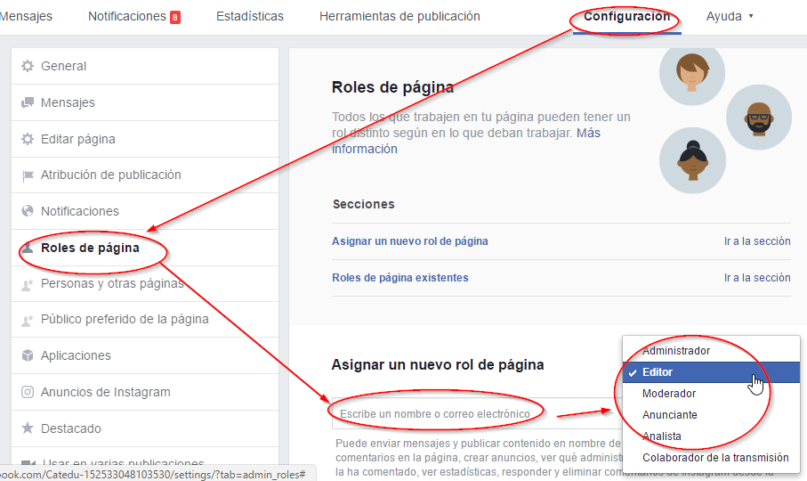

# Crea tu página

Para crear tu página tienes que estar de alta en Facebook de forma **personal**, a diferencia de Twitter, que se pueden crear cuentas genéricas pues sólo se necesita un correo electrónico.

Una vez que estas registrado de forma personal en Facebook puedes crear una página genérica

## Ser administrador de una página ya creada

Se pueden añadir administradores u otros roles a la página

