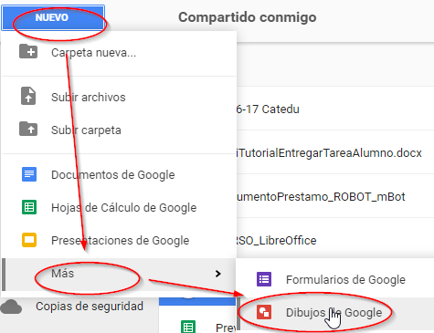
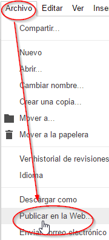
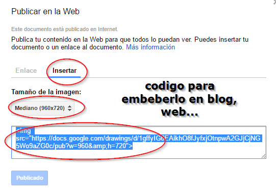

# Dibujos

Esta herramienta esta muy olvidada, y no hay razón de ser, está en **Nuevo** escondida en el botón **Más**.

Es un editor sencillo para crear dibujos, pero lo que destacamos es su posibilidad de **Compartir** y la posibilidad de **embeber**.

La de Compartir es igual que un documento de Google que hemos visto pero la de embeber, se realiza en **Archivo** -  **Publicar en la Web**

Y tenemos dos opciones

- La opción de que nos crea un enlace, por ejemplo este [enlace](https://docs.google.com/drawings/d/1gffyIG6EAikhO8fJyfxjOtnpwA2GJjCjNG5Wo9aZG0c/pub?w=960&amp;h=720).
- La opción de **embeberlo en Insertar**

Podemos ver cual es el efecto de embeberlo.** ¿Qué ventajas tiene?** La modificación de la imagen se actualiza automáticamente, cualquier cambio automáticamente es publicado.

*La mayoría de dibujos de este curso son dibujos Google embebidos, por ejemplo este:*

