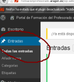
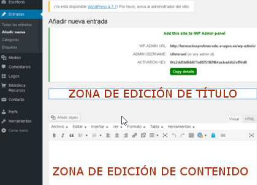
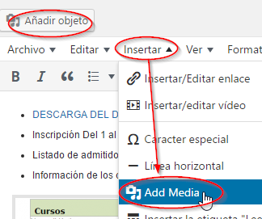
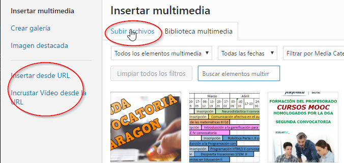
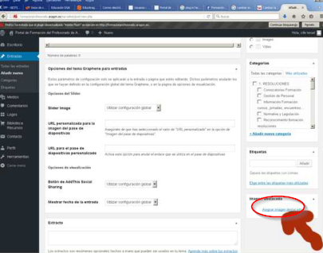
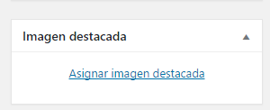
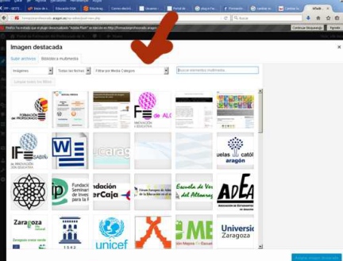

# Escribir una entrada

## Añadir o modificar las entradas

Entramos en el backend y en Entradas podemos añadir una nueva o editar las existentes

Editamos el título y el contenido. La edición de contenido permite enlaces, imágenes, etc… todo en el menú del editor de contenido.

## Insertar imagen o vídeo

Podemos añadir una imagen en un artículo

Podemos subir un archivo desde nuestro ordenador, o elegir uno ya subido de la galería. También podemos poner la URL de la imagen o la URL del vídeo (por ejemplo un vídeo de Youtube con la opción **INCRUSTAR VÍDEO DESDE LA URL**)

## Imagen que encabeza la entrada

Podemos seleccionar entre las imágenes destacadas que luego encabezarán la noticia: 

Elegimos alguna imagen subida o subimos nosotros la imagen

## 

