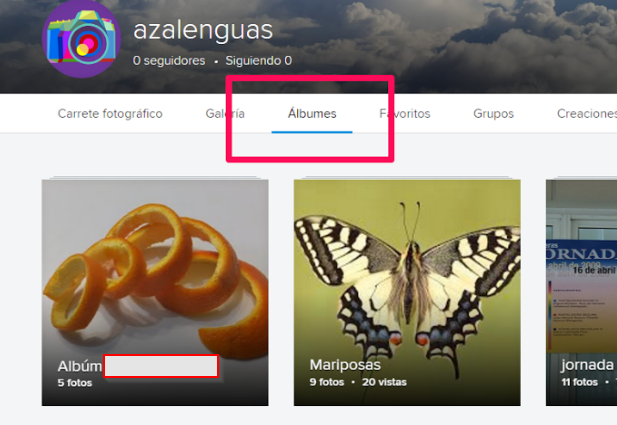
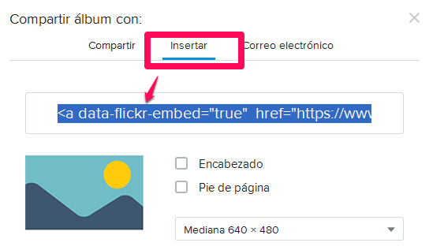

# Fotos

## **Flickr**

A veces en una actividad presencial, se crean fotos y todo el mundo necesita verlas, **FLICKR  es de Yahho** y te permite :

- Crear un enlace y todo el mundo puede ver las fotos
- O incrustar una imagen del álbum que tiene un enlace a todas las fotos, en nuestra web o blog, este es un ejemplo embebido:

*** ***

## ¿Cómo se hace flickr?

1.- REGISTRO: Tienes que estar registrado en [Yahoo](https://es.yahoo.com/) y luego entra en [Flickr](http://aularagon.catedu.es/materialesaularagon2013/blogs/M2_contenido/flickr.com)

2.- Creas un Album

.png)

3.- Se abre una ventana para arrastrar las fotos

.png)

## 

4.- .En la barra de menús de Flickr selecciona "****Tus álbumes".****

5.- En Álbumes tiene un botón para compartir:

**OJO EL ÁLBUM, NO LA FOTO !!!!**

6.- Y luego sale el código embed en Insertar:

**Ojo, que hay que compartir EL ÁLBUM no la foto**

Esto ESTA BIEN compartir ÁLBUM

  

 

 

  

ESTO ESTA MAL, COMPARTIR FOTO

 

 

¿no ves la diferencia? pues haz click en cada uno y verás

## Google Fotos

A veces tenemos que buscar una plataforma que además permita que los usuarios puedan subir también fotos

Google Fotos permite crear un álbum, compartirlo con otras personas y que los que reciben ese enlace puedan subir también fotos

El inconveniente que tiene es que no permite embeber

En[ este enlace ](http://aularagon.catedu.es/materialesaularagon2013/blogs/M2_contenido/fotos_google.html)puedes ver cómo se hace

