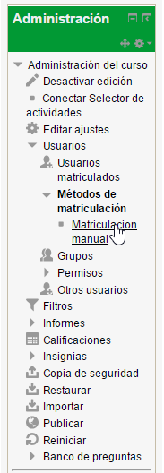
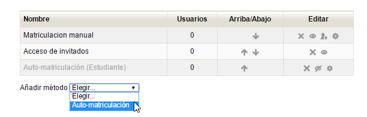
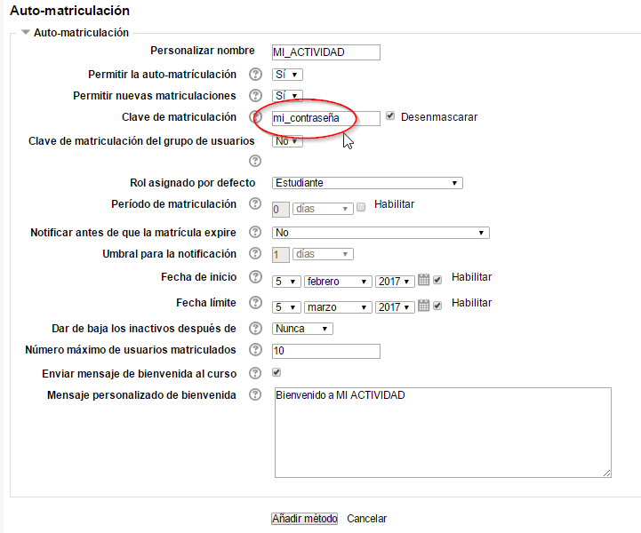

# Matricular participantes

Tenemos dos opciones:

- Poner nosotros a mano los usuarios y ponerles una contraseña
- Una automatriculación, mucho más cómodo

Para ello entramos en Ajustes del curso Matriculacion

Y añadimos el método de Automatriculación

Rellenamos los campos, sobre todo la contraseña que queramos y las fechas de inicio y final para matricularse

Los participantes tendrán que entrar en el curso y habrá un botón para matricularse donde se les pedirá la contraseña que hemos puesto ( y que tenemos que enviársela a los participantes anteriormente claro)

