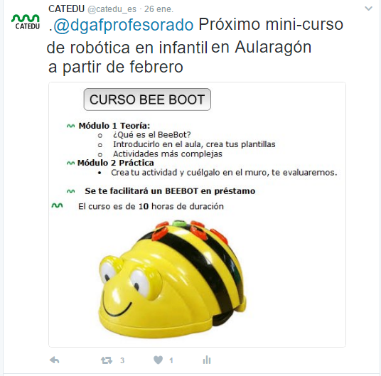

# Menciona

## Menciona a otros usuarios de la red de formación para que lo sepan

**Mención**  @ y un nombre de usuario, el mensaje lo verá el usuario que hemos escrito

- Si lo pones al **principio** los únicos usuarios que podrán verlo (además del destinatario y el remitente) son aquellos que siguen tanto al destinatario como al remitente (los dos a la vez) en su timeline. Entonces se llama **respuesta.**
- Si lo pones en el **cuerpo** del mensaje sólo lo verá el destinatario en la pestaña de **notificaciones.**
- También se ven en el perfil del remitente.
- Las menciones ya no cuentan en el límite de 280 carácteres [ver noticia 1/4/17](https://blog.twitter.com/2017/now-on-twitter-140-characters-for-your-replies)
- El [truco del punto](http://estwitter.com/2011/02/23/el-truco-del-punto/) permite que ese mensaje lo ve el usuario que se menciona y todos sus seguidores.
    - En la figura se menciona a [.@dgafprofesorado](mailto:.@dgafprofesorado) luego el mensaje lo vera @dgafprofesorado y todos sus seguidores.
- Cada uno en su ámbito
    - Si eres **ASESOR**, es importante difundirlo entre la red de formación Cifes. UFIs, servicios provinciales y centrales, por lo tanto usa [.@dgafprofesorado](mailto:.@dgafprofesorado) al principio si procede
    - Si eres **COFO** es importante la divulgación en el entorno de tu centro
- ¿Qué es mejor mención o respuesta?
    - ¿La respuesta a un Tweet es de utilidad a tus seguidores?:
        - SI: Utiliza la mención o el truco del punto
        - NO: Haz una respuesta

