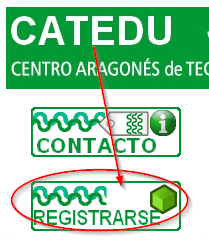

# Moodle

Si la actividad tiene parte que se tiene que hacer en red, lo mejor es pedir un curso en Moodle y colgar las actividades allí, pues las actividades de formación en red necesitan de una plataforma de seguimiento y control donde tiene que haber:

- Contenidos en Moodle se llama **recursos**
- las **actividades** que tienen que hacer los participantes
- diálogo entre los participantes y el tutor: **foros** y **mensajería**

Para crear un Moodle tienes que hacer igual que Word Press, pedirlo en CATEDU Registrar

Una vez que recibimos de CATEDU el usuario y la contraseña, vamos a ver:

- Configurar el curso y poner recursos
- Poner actividades
- matricular participantes
- tutorizar