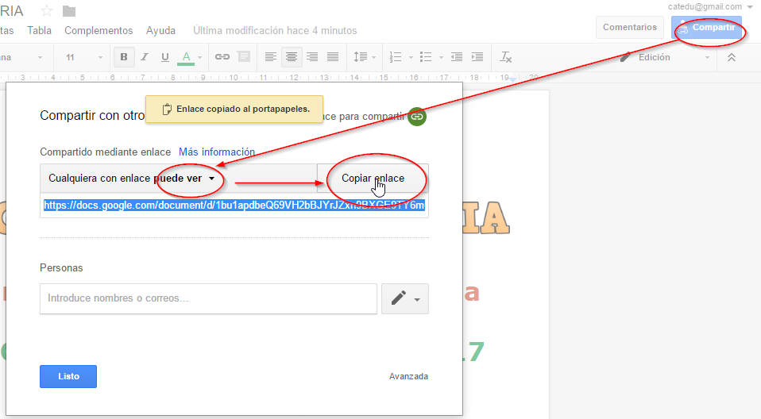
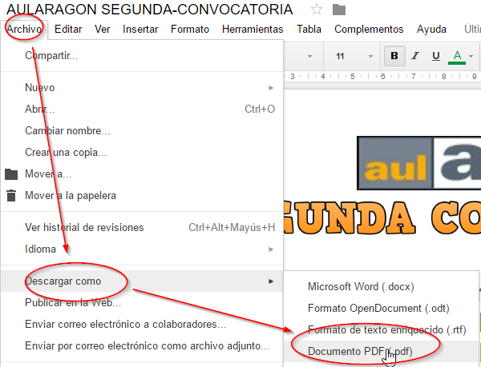

# Publicar

## Compartir solo lectura (publicar)

Una vez que tenemos el documento ya finalizado, podemos publicarlo en las redes sociales, página Web, etc... para obtener en enlace tenemos que rehacer los mismos pasos pero sólo lectura, tiene la ventaja que una modificación se refleja en el mismo documento.

No recomendamos **Archivo - Publicar en la Web** pues en el caso de los Documentos se trastoca todo [ver ejemplo](https://docs.google.com/document/d/1bu1apdbeQ69VH2bBJYrJZxn9BXGE9TY6m0hyVAHBmMI/pub)

En enlace es algo largo:

[https://docs.google.com/document/d/1bu1apdbeQ69VH2bBJYrJZxn9BXGE9TY6m0hyVAHBmMI/edit?usp=sharing](https://docs.google.com/document/d/1bu1apdbeQ69VH2bBJYrJZxn9BXGE9TY6m0hyVAHBmMI/edit?usp=sharing)

Siempre lo podemos acortar para publicarlo, o en un código QR : [https://goo.gl/VPoeRK](https://goo.gl/VPoeRK)

## Descargarlo como PDF

Aunque con el sistema anterior no hace falta pasarlo a PDF, no obstante en plataformas como DOCEO hay que publicarlo como PDF:

