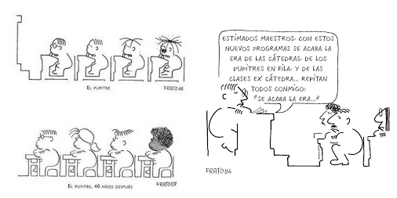

# Recuerda

La atención de los participantes es importante, **una actividad pasiva** no hará un impacto en los participantes, y mucho menos**** un cambio metodológico en las aulas**** que es nuestro objetivo

La **interactividad** permitirá que los asistentes participen, enriquezcan la actividad y asimilen mejor los contenidos.

Y si es con humor mejor...

