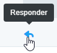
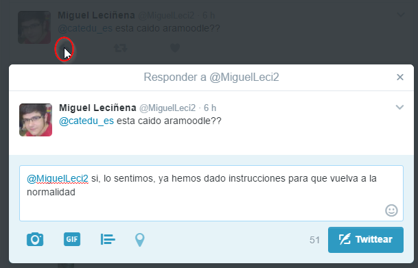
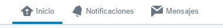

# Responde

Cuando en un mensaje pulsamos al icono de responder, se añade automáticamente una mención al usuario, @usuario, al principio, luego responder es una mención que lo ven el destinatario, el remitente y los seguidores de ambos.

Si alguien te envía una respuesta y no eres seguidor de ese usuario, entonces la respuesta no aparecerá en tu cronología de inicio. En cambio, la respuesta aparecerá en tu pestaña Notificaciones.

Por lo tanto hay que tener en cuenta que es una conversación pública.

Si quieres que la conversación sea **privada**, son **mensajes directos**, y es necesario que la otra persona también nos siga, luego en el botón mensajes, sólo lo podemos hacer a nuestros seguidores: es el icono de Mensajes

